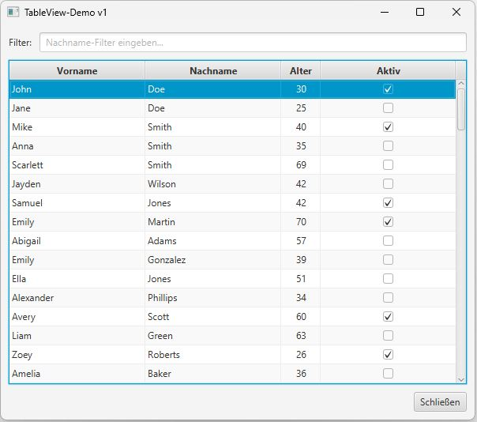

# TableView Beispielprojekt

## Beschreibung
Dieses Projekt demonstriert die Implementierung und Verwendung einer TableView in JavaFX. Es zeigt grundlegende bis fortgeschrittene Funktionen und dient als praktisches Beispiel für die Arbeit mit Tabellen in JavaFX-Anwendungen:

## Funktionen
- Erstellung und Konfiguration einer TableView
- Hinzufügen und Verwalten von Spalten
- Datenverwaltung mit ObservableList
- Implementierung von Filter- und Sortierfunktionen
- Beispiele für benutzerdefinierte Zellenformatierung

## Voraussetzungen
- Java SDK 23
- JavaFX (im Projekt enthalten)

## Quick Start
1. Projekt klonen
2. In IDE öffnen
3. Main-Klasse ausführen

## Lizenz
Dieses Projekt ist unter der [MIT Lizenz](https://opensource.org/licenses/MIT) lizenziert.

## Kontakt
Bei Fragen oder Anregungen erstellen Sie bitte ein Issue im Repository.